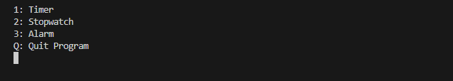

<p align="center">
  
  <h1 align="center">Tempo</h1>
</p>

<p align="center">
  <a href="https://app.codacy.com/gh/stobitejnr/Tempo/dashboard?utm_source=gh&utm_medium=referral&utm_content=&utm_campaign=Badge_grade">
    
  </a>
  <a href="https://github.com/stobitejnr/Tempo/actions/workflows/cmake.yml">
    
  </a>
</p>

<p align="center">
   <h2 align="center">A versatile command-line application that allows users to create and manage timers and stopwatches</h2>
</p>

<p align="center">
  <a href="https://forms.gle/yQKxxhWpJ1LWqaSq7">Click here</a> if you want to participate in the beta testing of the application.
</p>

## Developers
---
<p align="center">
  <span style="display: inline-block; text-align: center; margin: 0 10px;">
    <strong>William Donnelly</strong><br>
    
  </span>
  <span style="display: inline-block; text-align: center; margin: 0 10px;">
    <strong>Kevin Albert</strong><br>
    
  </span>
  <span style="display: inline-block; text-align: center; margin: 0 10px;">
    <strong>Rowan Zeszut</strong><br>
    
  </span>
  <span style="display: inline-block; text-align: center; margin: 0 10px;">
    <strong>Ben Sampson</strong><br>
    
  </span>
</p>

## Features
---
1. **Timer**: Set custom countdown timers with precise control.
   - Start, pause, and resume functionality
   - Add time to running timers
   - Reset timer
   - Visual progress bar
   - Customizable time increment

2. **Stopwatch**: Measure elapsed time with millisecond precision.
   - Start, pause, and resume functionality
   - Reset stopwatch
   - Create split times

3. **User-friendly Interface**:
   - ASCII art time display
   - Clear on-screen instructions
   - Responsive keyboard controls

## How to Run
---
1. Ensure you have CMAKE installed on your system.
2. Open an IDE and navigate to the project directory.
3. Run the CMakeLists.txt file to generate the project files.
4. Build and run the project.

## Usage
---
1. Upon starting the application, you'll be presented with a menu:



```The alarm feature is currently under development and is not available.```

2. Use the number keys to select a function or 'Q' to quit.

3. Follow the on-screen instructions to control each feature.

## Requirements
---
- C++ compiler with C++11 support
- Windows operating system (due to use of Windows-specific libraries)

## Future Enhancements
---
- Implement Alarm functionality
- Add sound notifications
- Expand platform support beyond Windows

## Contributions
---
We welcome contributions to Tempo! Please feel free to submit issues and pull requests.