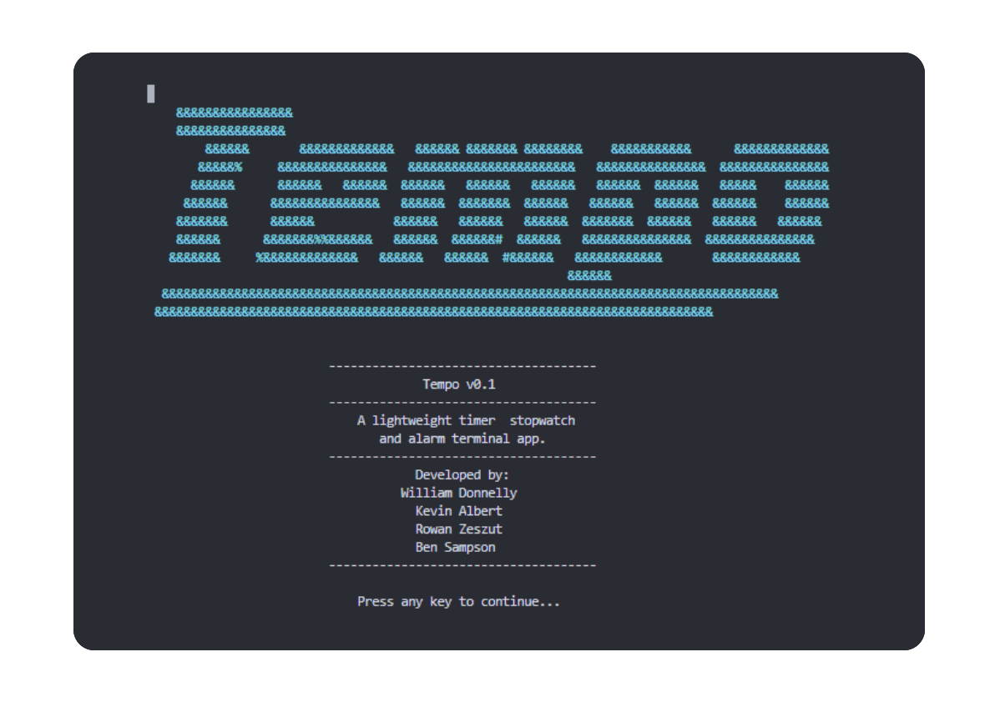

.png)
# Tempo

A versatile command-line application that allows users to create and manage timers and stopwatches

[Click here](https://forms.gle/yQKxxhWpJ1LWqaSq7) if you want to participate in the beta testing of the application.

## Developers

## Feature

1. **Timer**: Set custom countdown timers with precise control.
   - Start, pause, and resume functionality
   - Quickly create new timers
   - Reset timer
   - Visual progress bar

2. **Stopwatch**: Measure elapsed time with hundredth of a second precision.
   - Start, pause, and resume functionality
   - Reset stopwatch
   - Create split times

3. **User-friendly Interface**:
   - ASCII art time display
   - Clear on-screen instructions
   - Responsive keyboard controls

## How to Run

1. Ensure you have CMAKE installed on your system.
2. Open an IDE and navigate to the project directory.
3. Configure the project directory with CMake.
4. Build and run the project.

## Usage

1. Upon starting the application, you'll be presented with a menu:

   

   The alarm feature is currently under development and is not available.

2. Use the number keys to select a function or 'Q' to quit.
3. Follow the on-screen instructions to control each feature.

## Requirements

- C++ compiler with C++11 support
- Windows operating system (due to use of Windows-specific libraries)

## Future Enhancements

- Implement Alarm functionality
- Add sound notifications
- Expand platform support beyond Windows

## Contributions

We welcome contributions to Tempo! Please feel free to submit issues and pull requests.
